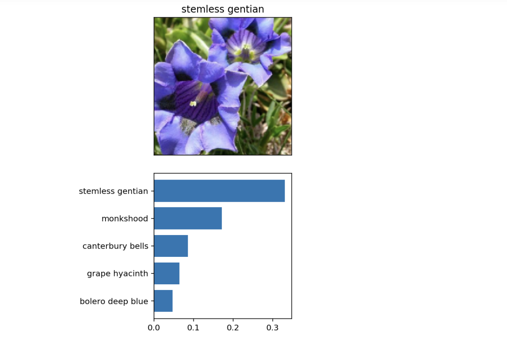

# AWS and Udacity AI with Python Project

### Inference image


## Description

Project code for Udacity's AI Programming with Python Nanodegree program. In this project,code for an image classifier built with PyTorch, then convert it into a command line application.

This repository contains an image classifier model trained on flowes folder for classifying images into top k categories. The model is implemented in pyTorch, and the code includes training, evaluation, and inference functionalities.


### Created by John Wanjema 02/19/20224

## Table of Contents

- [Installation](#installation)
- [Usage](#usage)
  - [Training](##training)
  - [Inference](####inference)
- [Dependencies](#dependencies)
- [Bugs](#bugs)
- [Support](#support)
- [License](#license)


## Installation

### Technologies used
- Python
- PyTorch
- Numpy
- Matplotlib

### clone the repository

```bash
git clone https://github.com/johnwanjema/Image-classifier-project
```

### Initialize git and add the remote repository

```bash
git init
```

```bash
git remote add origin <your-repository-url>
```

## Usage

### Training

To train the model on your own dataset, use the following command:

```bash

python train.py --dir data_dir --arch VGG  --learning_rate 0.01 --hidden_units 512 

```

### Inference

Use the trained model to classify an image:

```bash

python predict.py --image /path/to/image --checkpoint checkpoint --category_names cat_to_name.json --top_k 5
```

## Dependencies

The main dependencies and versions required to run the code are included in requirements.txt

## Bugs

Create an issue mentioning the bug you have found.

### Known bugs

- N/A

## Support

Contact [John Wanjema](jonwanjema@gmail.com) for further help/support.

## License

This project is licensed under the MIT License. See the LICENSE file for details.

